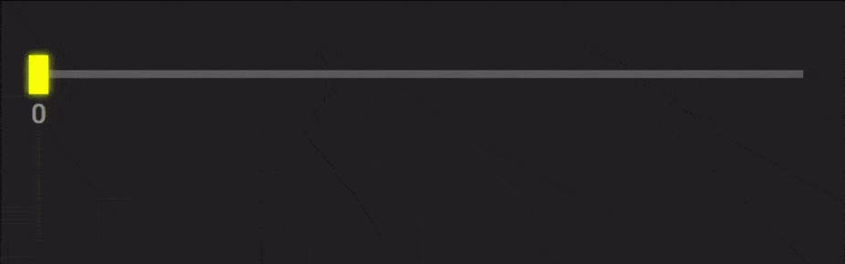

# Custom Ranges

Range.js is a simple JavaScript libruary that gives you possibility to easily create you own different range inputs and add them to your webpage.

## Getting started
###### HTML:
```HTML
<script src="Range.js"></script>
```
## Set Up
###### CSS:
```CSS
#range {
    height: 20px;
    width: 400px;
}
```
###### HTML:
```HTML
<div id="range"></div>
```
###### JS:
```JS
range = new Range({
    el: '#range',
});
```
As a result, the range input will be created in the **#range** container:


A large set of properties gives you the ability to create ranges of any shapes and colors. They are optional (exept first) so you can choose what to use or not. All available range properties are described below:
* el: '#id'
* bandHeight: 0
* bandColor: 'color'
* buttonWidth: 0
* buttonColor: 'color'
* minValue: 0
* maxValue: 0
* value: 0
* valueColor: 'color'
* hideValue: true
* fill: true

### Output
The input data is stored in **range.value** variable. Also **#range-text** block contains the range data which you can place anywhere in your document. 